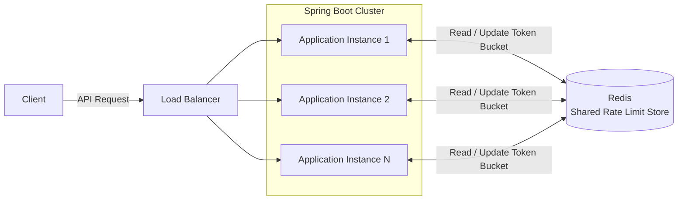
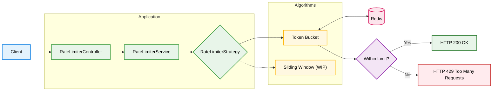

# Distributed Rate Limiter using Java

This repository contains a distributed rate limiter built using **Spring Boot** and **Redis**. The project explores the implementation of scalable API rate limiting techniques that can be used in distributed backend applications.

The project currently implements the **Token Bucket** algorithm for per-client rate limiting, with **Sliding Window** support under active development. Redis is used as the centralized storage to maintain rate limiting state across application instances, and is run using **Docker** during development.

The application follows a clean layered architecture with separate modules for controllers, services, repositories, models, DTOs, and configuration.

## Architecture

### How It Works

### Current Features

- Token Bucket rate limiting
- Redis integration using Docker
- Per-client request limiting
- REST API for testing
- Health check endpoint
- Custom exception handling

### Work in Progress

- Sliding Window rate limiting algorithm
- Additional rate limiting strategies
- Unit & Integration tests
- Docker Compose setup
- Add monitoring and metrics

### Project Structure

- `controller/` - REST APIs
- `service/` - Rate limiting logic
- `repository/` - Redis operations
- `exception/` - Exception handling
- `model/` - Domain models
- `dto/` - Request & response objects
- `config/` - Application configuration

This project is being developed as a backend system design and distributed systems learning project, with a focus on building production-oriented rate limiting mechanisms.

Thank you! 🚀
